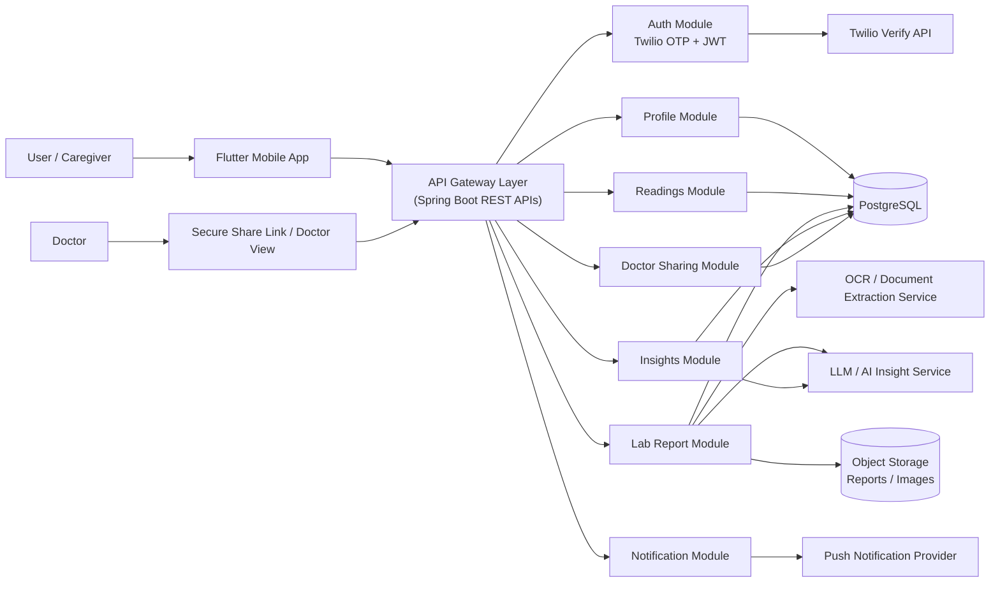
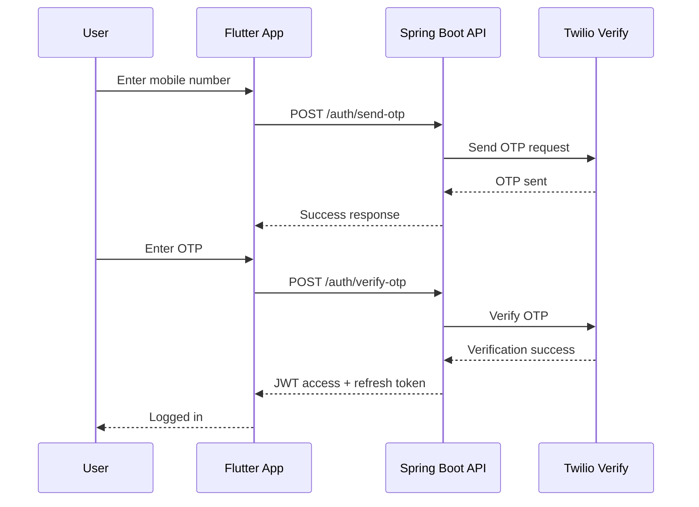
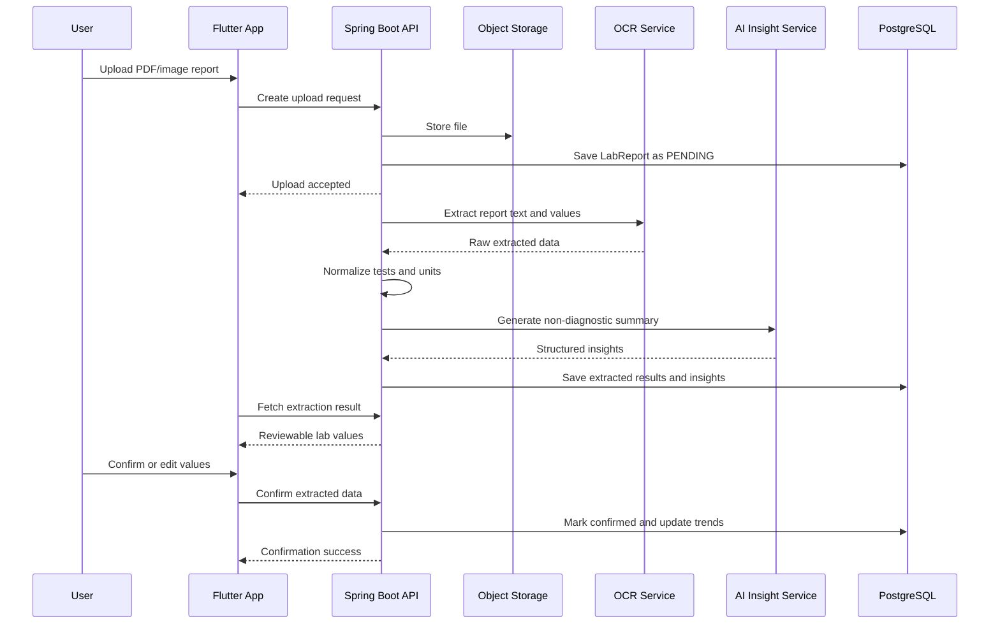
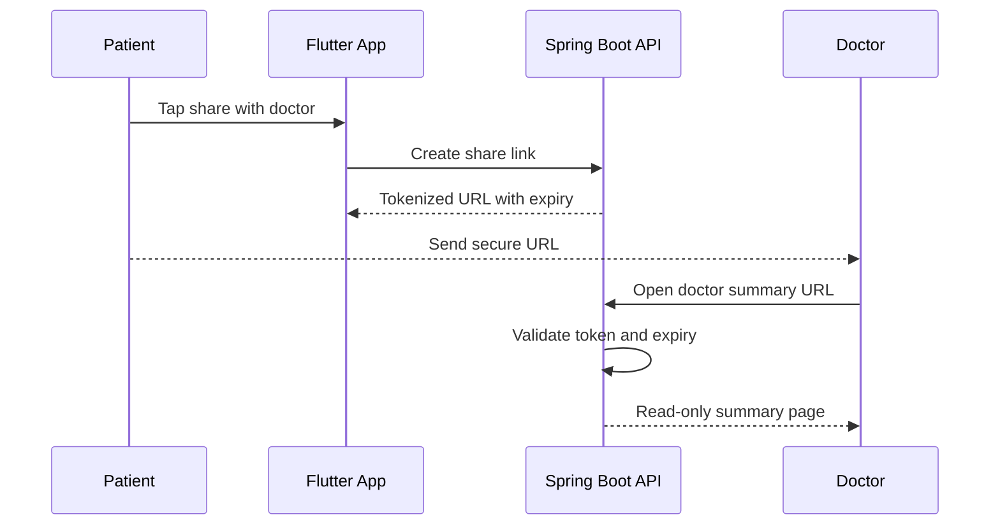

# HealthLensAI Architecture, HLD, LLD, and Delivery Phases

## 1. Requirement Summary

HealthLensAI is a mobile-first health intelligence platform for users to:

- sign in with mobile OTP
- upload lab reports and review extracted values
- track diabetes, blood pressure, and weight
- view trends and AI-generated non-diagnostic insights
- share structured summaries with doctors
- manage family member profiles

The application stack is:

- Frontend: Flutter mobile app
- Backend: Java with Spring Boot REST APIs

The strongest MVP value is not appointment booking or pharmacy commerce. It is structured health data capture plus understandable trend insights from reports and readings.

## 2. Recommended MVP

### Minimal Viable Mobile App

The MVP should include only the features that directly prove the product value:

1. Mobile OTP login with Twilio through Spring Boot
2. Family profile selection under one account
3. Lab report upload from PDF/image
4. OCR + AI extraction + user confirmation before save
5. Manual lab value entry
6. Manual glucose, blood pressure, and weight entry
7. Dashboard with trends for HbA1c, fasting glucose, BP, and weight
8. AI-generated simple explanations and lifestyle-oriented observations
9. Secure doctor sharing link for a patient summary
10. Notifications for missed logs and follow-up reminders

### Excluded from MVP

- Bluetooth device integration
- food image recognition
- doctor appointment marketplace
- lab booking marketplace
- medicine ordering
- full doctor app with prescription generation
- complex meal planning engine

## 3. Phase Plan

### Phase 1

Focus on core intelligence and retention:

- OTP login and JWT auth
- patient account with multiple family members
- report upload and manual lab entry
- chronic condition logging
- trend charts and AI insights
- doctor summary sharing link
- reminders and notifications
- admin panel for lab parameter mapping and moderation

### Phase 2

Add ecosystem and automation:

- Bluetooth device sync for supported devices
- image-based meal logging with confidence score
- Indian food database search and carb-focused diet tracking
- doctor appointment booking
- lab test booking with partner labs
- prescription upload and medication reminders
- diet patterns and meal plans
- pharmacy integration based on valid prescriptions
- richer doctor dashboard

## 4. Architecture Diagram



## 5. High-Level Design

### 5.1 Actors

- Patient
- Caregiver / family account owner
- Doctor using secure shared link
- Admin / operations user

### 5.2 Core Functional Domains

#### 1. Identity and Access

- Mobile number based login
- OTP send and verify via backend
- JWT access token and refresh token
- Role model: PATIENT, DOCTOR_VIEW, ADMIN

#### 2. Family Profile Management

- One account can own multiple health profiles
- Separate data isolation per family member
- Profile-level consent and share controls

#### 3. Lab Intelligence

- Upload PDF/image reports
- OCR extract text and values
- Normalize parameter names and units
- Let user confirm extracted values
- Persist structured observations by date

#### 4. Chronic Monitoring

- Manual readings for glucose, blood pressure, weight
- Time-series storage
- Trend charts
- Abnormality flags using non-alarming language

#### 5. AI Insights

- Correlate labs, readings, and optionally diet
- Provide plain-language summaries
- Never diagnose or prescribe
- Always show disclaimer

#### 6. Doctor Sharing

- Generate time-limited tokenized link
- Show concise pre-consultation summary
- Read-only access

#### 7. Notifications

- Follow-up reminders
- Missed logging reminders
- Upload review pending reminders

### 5.3 Suggested Deployment View

For MVP, keep deployment simple:

- Flutter app for Android first, then iOS
- Spring Boot monolith with modular package boundaries
- PostgreSQL as primary database
- S3-compatible object storage for reports/images
- Redis for OTP/session cache and short-lived share tokens
- AI/OCR as external provider integrations
- Firebase Cloud Messaging for push notifications

### 5.4 Non-Functional Requirements

- API response target: under 500 ms for normal CRUD APIs
- Async processing for OCR and AI insight generation
- Audit logs for sensitive data access
- Encryption in transit and at rest
- Consent-based doctor access
- Easy-to-read UI with large touch targets and high contrast

## 6. Low-Level Design

### 6.1 Suggested Backend Modules

#### Auth Service

Responsibilities:

- send OTP
- verify OTP
- issue JWT tokens
- manage refresh tokens

Key APIs:

- `POST /api/v1/auth/send-otp`
- `POST /api/v1/auth/verify-otp`
- `POST /api/v1/auth/refresh`
- `POST /api/v1/auth/logout`

#### Profile Service

Responsibilities:

- create account profile
- add family member
- switch active profile
- manage consent preferences

Key APIs:

- `GET /api/v1/profiles`
- `POST /api/v1/profiles`
- `PUT /api/v1/profiles/{profileId}`
- `POST /api/v1/profiles/{profileId}/consents`

#### Reading Service

Responsibilities:

- store glucose/BP/weight entries
- return trend aggregates
- flag unusual readings

Key APIs:

- `POST /api/v1/profiles/{profileId}/readings`
- `GET /api/v1/profiles/{profileId}/readings`
- `GET /api/v1/profiles/{profileId}/readings/trends`

#### Lab Report Service

Responsibilities:

- upload report metadata
- store original document
- trigger OCR and AI extraction
- expose extracted values for confirmation
- save normalized lab observations

Key APIs:

- `POST /api/v1/profiles/{profileId}/lab-reports`
- `GET /api/v1/profiles/{profileId}/lab-reports`
- `GET /api/v1/lab-reports/{reportId}`
- `POST /api/v1/lab-reports/{reportId}/confirm`
- `POST /api/v1/profiles/{profileId}/lab-results/manual`

#### Insight Service

Responsibilities:

- prepare trend context
- call AI provider with guardrails
- persist generated summaries

Key APIs:

- `POST /api/v1/profiles/{profileId}/insights/generate`
- `GET /api/v1/profiles/{profileId}/insights/latest`
- `GET /api/v1/profiles/{profileId}/summaries/doctor`

#### Sharing Service

Responsibilities:

- create secure doctor share link
- validate expiry and scope
- provide read-only summary payload

Key APIs:

- `POST /api/v1/profiles/{profileId}/share-links`
- `GET /api/v1/share/{token}/summary`
- `DELETE /api/v1/share-links/{shareId}`

#### Notification Service

Responsibilities:

- register device token
- schedule reminders
- send push notifications

Key APIs:

- `POST /api/v1/devices/register`
- `POST /api/v1/profiles/{profileId}/reminders`
- `GET /api/v1/profiles/{profileId}/notifications`

### 6.2 Suggested Database Entities

```text
User
- id
- mobile_number
- status
- created_at

UserSession
- id
- user_id
- refresh_token_hash
- expires_at

Profile
- id
- user_id
- name
- relation
- dob
- gender
- blood_group
- is_primary

Consent
- id
- profile_id
- consent_type
- granted
- granted_at

LabReport
- id
- profile_id
- file_url
- source_type
- report_date
- parse_status
- uploaded_at

LabResult
- id
- report_id
- profile_id
- test_code
- test_name
- value
- unit
- normalized_value
- normalized_unit
- reference_range
- observed_at
- confirmed_by_user

Reading
- id
- profile_id
- reading_type
- systolic
- diastolic
- numeric_value
- unit
- source
- recorded_at

Insight
- id
- profile_id
- insight_type
- period_start
- period_end
- summary_json
- disclaimer
- generated_at

ShareLink
- id
- profile_id
- token_hash
- expires_at
- status

Reminder
- id
- profile_id
- reminder_type
- schedule_rule
- next_trigger_at
- status

DeviceToken
- id
- user_id
- platform
- token
```

### 6.3 Flutter App Module Design

Recommended Flutter layers:

- `presentation`
- `application`
- `domain`
- `data`

Suggested feature folders:

```text
lib/
  core/
    networking/
    storage/
    theme/
    widgets/
  features/
    auth/
    profiles/
    dashboard/
    lab_reports/
    readings/
    insights/
    sharing/
    notifications/
```

Screen list for MVP:

- Splash / session restore
- Mobile number login
- OTP verification
- Profile chooser
- Home dashboard
- Upload report
- Review extracted lab values
- Manual lab entry
- Add reading
- Trends and insights
- Share with doctor
- Reminder settings

### 6.4 Recommended Processing Pattern

Use asynchronous event-driven processing for report extraction:

1. User uploads report
2. API stores file and creates `LabReport` row with `PENDING`
3. Background worker picks job
4. OCR extracts text
5. Parser maps tests and units
6. AI service generates human-readable summary
7. User reviews and confirms data
8. Dashboard refreshes trends

For MVP this can still live inside the Spring Boot codebase using:

- Spring Scheduler or a queue-backed worker
- a job table for retries and status tracking

### 6.5 Integration Design

#### Twilio

- Backend-only integration
- Never expose Twilio credentials to Flutter
- Use Verify API if possible rather than implementing custom OTP state

#### OCR

Options:

- Google Document AI
- AWS Textract
- Azure Document Intelligence
- specialized lab parser later if needed

#### AI Insight Layer

Pass only normalized and minimal required patient context.

Prompt guardrails should enforce:

- no diagnosis
- no medication advice
- simple language
- confidence-aware wording
- mandatory disclaimer

#### Storage

- PostgreSQL for transactions and health records
- Redis for temporary state
- object storage for report files

## 7. Sequence Diagrams

### 7.1 Login with OTP



### 7.2 Lab Report Upload and Insight Generation



### 7.3 Doctor Share Link



## 8. HLD to LLD Traceability

| Requirement Area | HLD Module | LLD Components |
|---|---|---|
| OTP login | Identity and Access | Auth controller, Twilio client, JWT provider, session store |
| family members | Family Profile Management | Profile controller, profile service, consent tables |
| lab upload | Lab Intelligence | upload API, OCR adapter, parser, normalization engine |
| manual lab entry | Lab Intelligence | manual result API, validation rules |
| glucose/BP/weight logs | Chronic Monitoring | reading controller, trend query service |
| AI summaries | AI Insights | prompt builder, safety validator, summary persistence |
| doctor review | Doctor Sharing | share link service, doctor summary renderer |
| reminders | Notifications | scheduler, FCM integration, reminder table |

## 9. Key Design Decisions

### Monolith First

Use a modular Spring Boot monolith for MVP. Do not split into microservices yet.

Reason:

- smaller team velocity
- lower operational overhead
- easier transaction consistency
- AI/OCR integrations can still be isolated behind interfaces

### Android First

Launch Android first if budget or team size is constrained, because the target market and caregiver usage in India are likely Android-heavy.

### Human-in-the-Loop Extraction

Never auto-save OCR extracted lab values without user confirmation. This directly reduces medical and trust risk.

### Read-Only AI

AI must explain trends and awareness only.

Never allow:

- diagnosis
- prescription advice
- medication recommendation
- emergency triage claims without validated clinical workflow

## 10. Risks and Mitigations

| Risk | Impact | Mitigation |
|---|---|---|
| OCR errors from varied lab formats | wrong trends | mandatory user review before save |
| AI overstatement | compliance risk | strict prompt guardrails and disclaimer enforcement |
| sensitive health data exposure | trust and legal risk | encryption, audit logs, expiring share links |
| too many integrations in MVP | delivery delay | keep partner ecosystems for phase 2 |
| poor elderly usability | low adoption | large fonts, fewer steps, simple navigation |
| unsupported device sync complexity | support burden | manual entry first, Bluetooth later |

## 11. Suggested Tech Stack

### Mobile

- Flutter
- Riverpod or Bloc for state management
- Dio for API client
- Hive or secure storage for session caching
- FL Chart or Syncfusion charts
- Firebase Cloud Messaging

### Backend

- Java 21
- Spring Boot
- Spring Security with JWT
- Spring Data JPA
- PostgreSQL
- Redis
- Flyway
- OpenAPI / Swagger
- Quartz or scheduler-backed jobs

### Infra

- Docker
- Nginx or API gateway
- AWS / Azure / GCP
- S3-compatible object storage
- monitoring with Prometheus + Grafana or managed equivalent

## 12. Suggested Roadmap

### 0 to 6 weeks

- finalize data model
- build OTP auth
- build profile management
- build manual readings and dashboard
- build report upload and file storage

### 6 to 12 weeks

- OCR extraction pipeline
- confirmation workflow
- AI summaries
- doctor sharing
- reminder engine

### 12+ weeks

- food tracking
- Bluetooth integrations
- doctor booking
- lab booking
- commerce integrations

## 13. Final Recommendation

HealthLensAI should be positioned as a health tracking and insight platform, not as a diagnostic or treatment app. The best phase-1 strategy is to become extremely good at:

- structuring lab reports
- showing trends simply
- correlating readings over time
- generating safe and useful summaries for users and doctors

That is the narrowest path to a credible MVP with clear user value and manageable technical risk.
